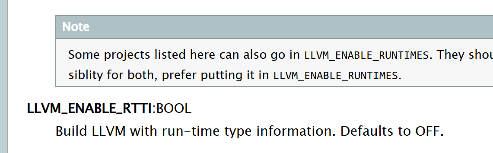

# 编译以及运行

新加的向量化pass是 `--erqi-vec`

代码里用到了`rtti`。所以得开了`riit`选项再编译整个llvm和bolt。

[Building LLVM with CMake — LLVM 20.0.0git documentation](https://llvm.org/docs/CMake.html)



编译选项

```bash

erq@solegpu2:~/llvm/build/rtti_debug$ cmake -S <llvm-project-directory>/llvm -B . \
    -G Ninja \
    -DLLVM_ENABLE_PROJECTS="clang;bolt" \
    -DCMAKE_BUILD_TYPE=Debug \
    -DLLVM_ENABLE_RTTI=ON \
    -DLLVM_ENABLE_EH=ON \
    -DLLVM_TARGETS_TO_BUILD="X86;AArch64" \
    -DCMAKE_CXX_STANDARD=17
    
    
erq@solegpu2:~/llvm/build/rtti_debug$ ninja
```

设计方法等内容在PPT中。
